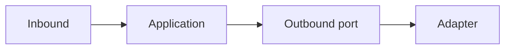

# Example flow (replace this document)

**Scope:** Describe what part of *this* repository the document covers.

**Related:** Link to HEPs, `harbour-technical-design.md`, or `AGENTS.md` as needed.

## Goal

One paragraph: what the reader should understand after reading this doc.

## Diagram

Explain the diagram in prose immediately after it—what each node means in *this* codebase.

## Out of scope

What this document deliberately does not cover.
