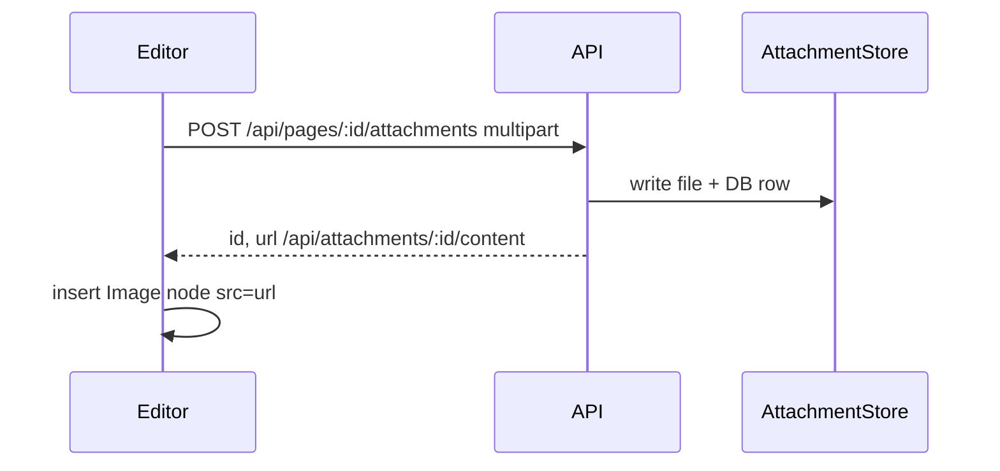

# Notes editor and attachments

**Scope:** TipTap rich text, image upload pipeline, markdown export.

## Editor

- **Library:** [TipTap](https://tiptap.dev/) v3 on ProseMirror.
- **Extensions (MVP):** StarterKit (headings, lists, bold, italic, code, blockquote) + Image.
- **Storage:** `pages.content_json` as serialized ProseMirror JSON string.
- **Search index:** `content_plain` derived via `extractPlainText()` on save.

## Image upload flow

- Only `image/*` MIME types accepted in MVP.
- Files stored at `{DATA_DIR}/attachments/{storageKey}`.
- Serving: `GET /api/attachments/:id/content` (same-origin, gateway-authenticated).

## Markdown export

- `GET /api/pages/:id/export/markdown` returns `text/markdown` attachment.
- Converter walks TipTap JSON (`src/shared/tiptap-to-markdown.ts`) — headings, paragraphs, lists, bold/italic/code/links, images.

## Local development

- Vite proxies `/api` to the API process (`VITE_API_PROXY_TARGET`, default `http://localhost:3001`).
- Without Docker, set `TRUST_GATEWAY_HEADERS=false` and `DEV_USER_ID` for stub identity.
